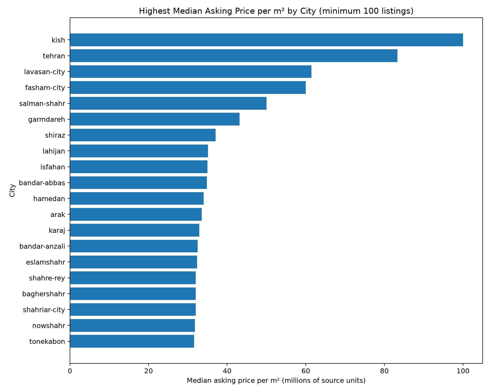
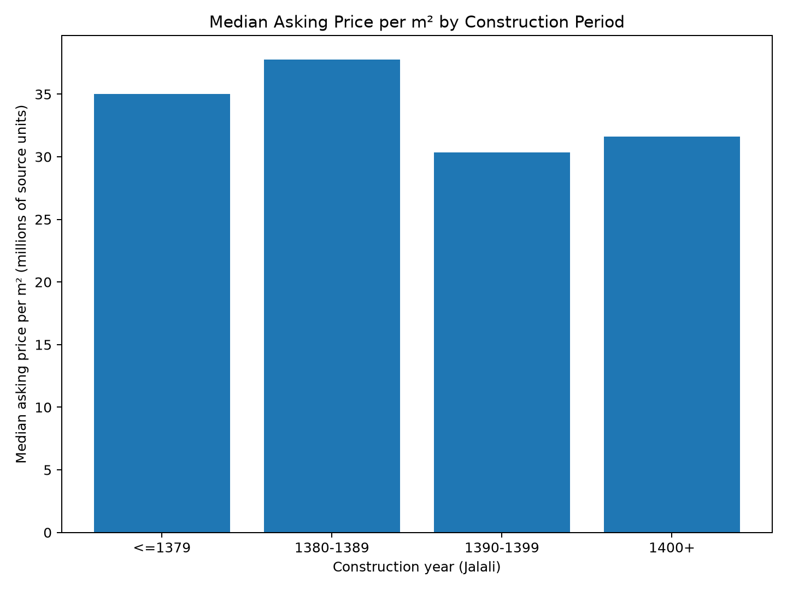

# Iran Residential Real Estate Market Analysis


A nationwide, reproducible data-analysis project examining residential property listings across Iran, with a focus on **asking-price patterns, regional differences, property characteristics, modernization-related indicators, and out-of-time predictive modeling**.

**Author:** Mohammad Amin Igder  
**Coverage in the current analytical sample:** 420 Iranian cities  
**Core analytical sample:** 516,947 residential-sale listings

## Why this project

This project connects real-estate domain knowledge with Python-based market analysis and machine learning. It is designed as a professional portfolio project for work in real estate, business analysis, market research, commercial strategy, and data-informed decision making.

The analysis addresses questions such as:

- How do residential asking prices and price per square metre differ across Iranian cities?
- Which cities dominate listing activity in the nationwide sample?
- How are property characteristics and amenities associated with asking prices?
- How much predictive information remains after controlling for location, size, age, rooms, property category, and amenities?
- Can a nonlinear model generalize to later listings better than a simple location benchmark?
- What can be learned from listing data without confusing advertised prices with completed transaction prices?

## Data source

The project uses the **Divar Real Estate Ads Dataset**, published by Divar on Hugging Face. The official source contains **1,000,000 anonymized real-estate advertisements** and 57 fields covering listing category, city, neighborhood, price, property size, construction year, amenities, and approximate geographic information.

Source: https://huggingface.co/datasets/divarofficial/real_estate_ads

The raw dataset is **not redistributed in this repository**. The reproducible download script retrieves it from the official source.

> **Important:** prices are treated as advertised/listing values, not verified final transaction prices. The official documentation does not clearly specify the monetary denomination of `price_value`, so this project labels monetary values as **source units** unless independently verified.

## Validated nationwide sample

The automated pipeline successfully processed the official source data and produced the following analytical sample:

| Metric | Result |
| --- | ---: |
| Residential-sale rows with usable price and building size | 533,242 |
| Analysis-ready rows before tail filtering | 522,163 |
| Core sample after 0.5% lower/upper price-per-m² tail filtering | 516,947 |
| Cities represented | 420 |
| Observed listing-month range | Feb 2021 – Mar 2025 |
| Median building size | 110 m² |
| Median asking price | 2.80B source units |
| Median asking price per m² | 27.71M source units |

### Largest city samples

| City | Listings | Median asking price / m² |
| --- | ---: | ---: |
| Tehran | 91,836 | 83.33M |
| Mashhad | 33,624 | 30.20M |
| Karaj | 26,725 | 32.93M |
| Isfahan | 18,571 | 35.00M |
| Shiraz | 16,949 | 37.06M |

These are **descriptive listing-market statistics**, not transaction-price indices.




## Advanced modeling: interpretation + prediction

A single model is not used for every purpose. The project deliberately separates **interpretability** from **predictive performance**:

1. **Regularized hedonic Ridge model** — an interpretable multivariable model for controlled associations.
2. **Target-encoded gradient-boosting model** — a nonlinear benchmark that captures interactions and complex relationships.
3. **Location median baseline** — a deliberately simple benchmark based on city-neighborhood medians.

All three are evaluated on the **same out-of-time holdout: October 2024 through March 2025**. The validation observations are not used to fit either advanced model.

### Out-of-time model comparison

| Model | R² on log price/m² | Log RMSE | Median absolute % error | Predictions within 20% |
| --- | ---: | ---: | ---: | ---: |
| Location median baseline | 0.193 | 1.535 | **28.4%** | **38.6%** |
| Hedonic Ridge | 0.281 | 1.448 | 38.0% | 25.1% |
| Nonlinear gradient boosting | **0.334** | **1.394** | 31.2% | 32.3% |

The nonlinear model explains substantially more out-of-time variation and has the lowest log-scale RMSE. The simple location baseline, however, retains a lower median percentage error. This trade-off is reported explicitly rather than selecting a metric after seeing the results.


### What drives predictive performance?

Permutation analysis on the temporal holdout indicates that the model relies most heavily on:

- city-neighborhood location;
- building size;
- detailed property category;
- elevator availability;
- spatial longitude / latitude and city information;
- room count, construction year, and parking availability.


The project also produces city-level validation diagnostics so nationwide performance cannot hide markets where predictions are systematically weaker or biased.

## Amenities and modernization-related indicators

Raw nationwide comparisons show substantial differences in median asking price per m² between properties with and without several amenities:

| Feature | Without feature | With feature |
| --- | ---: | ---: |
| Elevator | 28.13M | 39.76M |
| Parking | 22.85M | 34.00M |
| Storage / warehouse | 24.67M | 33.33M |
| Rebuilt / renovated status | 28.75M | 35.75M |

After a nonlinear model controls for the included location and property variables, the estimated associations become smaller: elevator availability is associated with approximately **+23.2%** and parking with approximately **+14.9%** in predicted asking price per m² on the counterfactual validation sample. These are **conditional model associations, not causal price premiums**.




## Methodological note: modernization vs. architectural style

The Divar dataset does **not** directly label properties as having a "modern" or "traditional" architectural style. This project therefore does not invent that classification.

Instead, construction year and available amenities are treated as **observable modernization-related indicators**. Conclusions are framed as statistical associations in listing data rather than proof that an architectural style causes a particular price premium.

Full methodology: [`docs/methodology.md`](docs/methodology.md)

## Portfolio artifacts

- [`outputs/EXECUTIVE_SUMMARY.md`](outputs/EXECUTIVE_SUMMARY.md) — business-facing interpretation of the advanced analysis.
- [`outputs/MODEL_CARD.md`](outputs/MODEL_CARD.md) — hedonic Ridge model documentation.
- [`outputs/PREDICTIVE_MODEL_CARD.md`](outputs/PREDICTIVE_MODEL_CARD.md) — nonlinear predictive model documentation.
- [`notebooks/01_advanced_market_analysis.ipynb`](notebooks/01_advanced_market_analysis.ipynb) — portfolio walkthrough with model comparison and visuals.
- [`outputs/predictive_city_validation.csv`](outputs/predictive_city_validation.csv) — city-level out-of-time diagnostic table.
- [`outputs/model_comparison.csv`](outputs/model_comparison.csv) — machine-readable benchmark comparison.

## Data-quality note

The official Hugging Face dataset card describes a six-month 2024 collection period, while the currently published data contains `created_at_month` values covering a wider interval. In the filtered residential-sale sample, the pipeline observes dates from **February 2021 through March 2025**. The project therefore reports the dates actually present in the downloaded data rather than hard-coding the dataset-card period.

## Repository structure

```text
Iran-Real-Estate-Market-Analysis/
├── README.md
├── LICENSE
├── requirements.txt
├── docs/
│   └── methodology.md
├── data/
│   └── README.md
├── notebooks/
│   └── 01_advanced_market_analysis.ipynb
├── src/
│   ├── download_data.py
│   ├── prepare_sales_data.py
│   ├── market_analysis.py
│   ├── advanced_model.py
│   └── predictive_model.py
├── outputs/
│   ├── EXECUTIVE_SUMMARY.md
│   ├── MODEL_CARD.md
│   ├── PREDICTIVE_MODEL_CARD.md
│   ├── market_summary.json
│   ├── model_comparison.csv
│   ├── predictive_city_validation.csv
│   └── charts and supporting tables...
└── .github/workflows/
    ├── code-quality.yml
    └── run-analysis.yml
```

## Reproduce the full analysis locally

```bash
python -m venv .venv
pip install -r requirements.txt
python src/download_data.py
python src/prepare_sales_data.py
python src/market_analysis.py
python src/advanced_model.py
python src/predictive_model.py
```

The large raw and processed data files are intentionally excluded from Git. GitHub Actions rebuilds the project from the official source and commits compact validated outputs automatically.

## Reproducibility and data ethics

- Source data is anonymized by the publisher.
- Raw data is not committed to this repository.
- Cleaning rules are implemented in code rather than manually in a spreadsheet.
- Price-per-m² outlier treatment and city sample thresholds are explicit and reproducible.
- Asking prices are never presented as completed-sale transaction prices.
- Geographic fields are treated as approximate rather than exact addresses.
- Amenity-price relationships are described as associations, not causal effects.
- Predictive validation is temporal rather than a convenient random split.
- A simple location benchmark is retained so model complexity must justify itself empirically.

## License and attribution

The Divar source dataset is published under the **Open Database License (ODbL)**. Dataset licensing and attribution remain with the original publisher. The code in this repository is licensed separately under the MIT License; see [`LICENSE`](LICENSE).

## Next analytical extensions

- Deep-dive into Tehran and other large markets at neighborhood level where coverage permits.
- Test monthly stability before building city-level time indices.
- Add duplicate-listing sensitivity checks and robustness analysis.
- Explore spatial and city-group validation to test generalization beyond familiar neighborhoods.
- Validate the source monetary denomination before presenting converted currency values.
- Investigate quantile models to distinguish median-market prediction from upper/lower market segments.

---

*This is an analytical portfolio project and should not be interpreted as investment, valuation, legal, or certified appraisal advice.*
