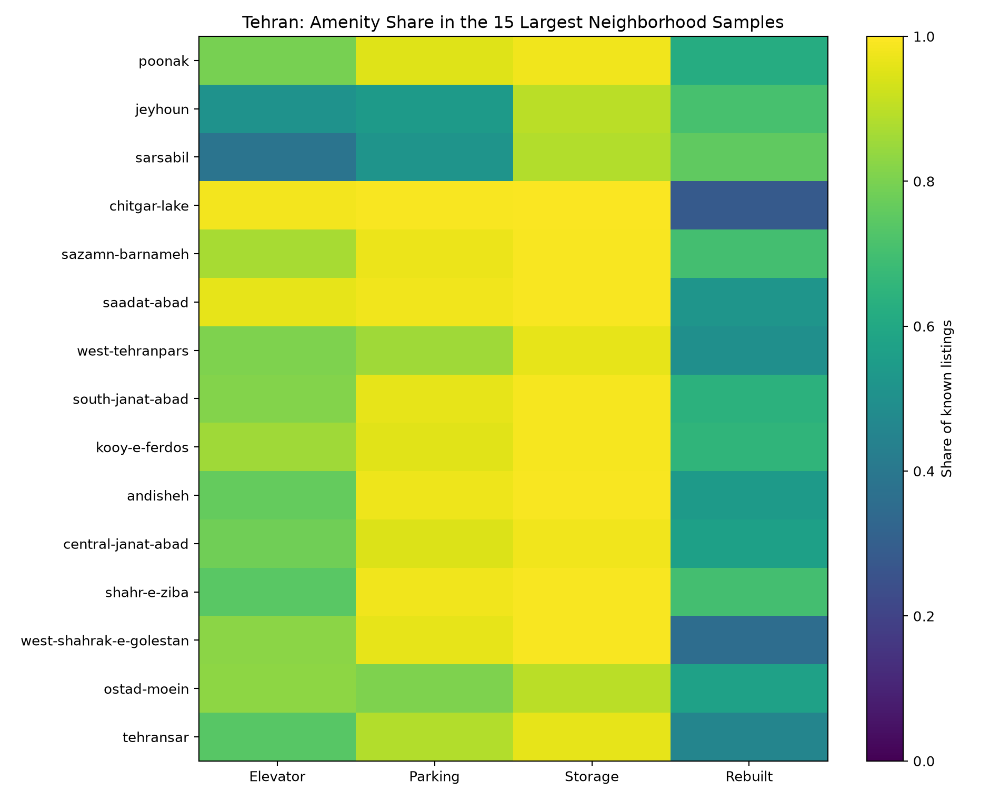
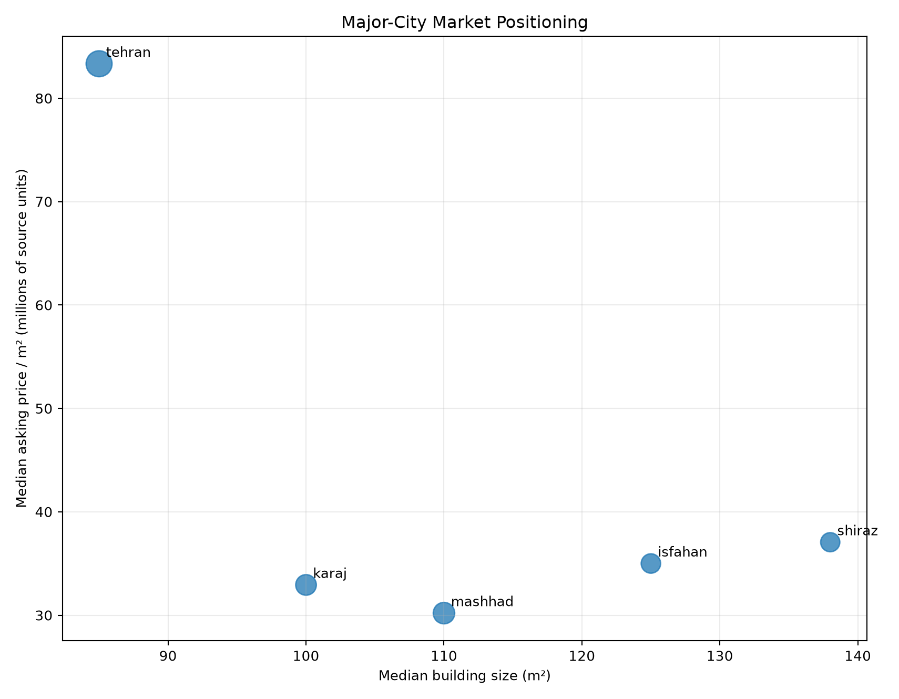
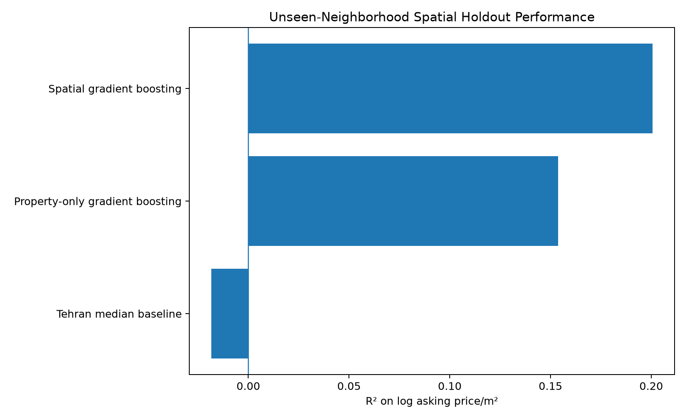

# Iran Residential Real Estate Market Analysis


A nationwide, reproducible real-estate data project covering **market analysis, Tehran neighborhood intelligence, approximate spatial mapping, time-series tracking, machine-learning benchmarks, uncertainty analysis, duplicate-risk sensitivity, unseen-neighborhood validation, and market segmentation**.

**Author:** Mohammad Amin Igder  
**Current analytical coverage:** 420 Iranian cities  
**Core sample:** 516,947 residential-sale listings

## Why this project

This portfolio project combines real-estate domain knowledge with Python-based market analysis and machine learning. It is designed to demonstrate skills relevant to real estate, business analysis, market research, commercial strategy, and data-informed decision making.

It asks practical questions such as:

- How do residential asking prices and price per square metre differ across Iranian cities?
- Which Tehran neighborhoods sit in higher- and lower-price market tiers?
- How stable are neighborhood price estimates once sampling uncertainty is measured?
- How sensitive are headline statistics to duplicate-like listings?
- Can a model generalize to a Tehran neighborhood it has never seen during training?
- How do raw city trends change after controlling for shifts in the mix of listed properties?
- Which property characteristics and modernization-related amenities are associated with asking prices?

## Data source

The project uses the **Divar Real Estate Ads Dataset**, published by Divar on Hugging Face. The source contains **1,000,000 anonymized real-estate advertisements** and 57 fields covering listing category, city, neighborhood, price, size, construction year, amenities, and approximate geographic information.

Source: https://huggingface.co/datasets/divarofficial/real_estate_ads

The raw dataset is **not redistributed in this repository**. The pipeline downloads it from the official source.

> **Important:** the analysis uses advertised/listing values, not verified final transaction prices. The official documentation does not clearly specify the monetary denomination of `price_value`, so monetary values are labelled **source units** unless independently verified.

## Validated nationwide sample

| Metric | Result |
| --- | ---: |
| Residential-sale rows with usable price and size | 533,242 |
| Analysis-ready rows before tail filtering | 522,163 |
| Core sample after 0.5% lower/upper price-per-m² tail filtering | 516,947 |
| Cities represented | 420 |
| Observed listing-month range | Feb 2021 – Mar 2025 |
| Median building size | 110 m² |
| Median asking price | 2.80B source units |
| Median asking price per m² | 27.71M source units |

### Largest city samples

| City | Listings | Median asking price / m² |
| --- | ---: | ---: |
| Tehran | 91,836 | 83.33M |
| Mashhad | 33,624 | 30.20M |
| Karaj | 26,725 | 32.93M |
| Isfahan | 18,571 | 35.00M |
| Shiraz | 16,949 | 37.06M |


## Tehran & major-cities deep dive

Tehran contains **91,836** listings in the core sample, with **345 neighborhood identifiers**. For price ranking, neighborhoods require at least **250 listings** and the ranking uses a sample-size-stabilized benchmark that shrinks smaller samples toward the Tehran-wide median.

### Highest stabilized Tehran neighborhood benchmarks

| Neighborhood | Listings | Stabilized asking price / m² | Raw median vs Tehran |
| --- | ---: | ---: | ---: |
| Zafaraniyeh | 795 | 190.39M | +181.2% |
| Elahiyeh | 642 | 178.04M | +170.7% |
| Velenjak | 531 | 175.91M | +179.7% |
| Niavaran | 878 | 167.76M | +136.1% |
| Farmaniyeh | 638 | 166.02M | +147.3% |
| Darrous | 706 | 161.16M | +133.1% |
| Saadat Abad | 1,590 | 155.82M | +102.3% |
| Qeytariyeh | 950 | 149.71M | +103.2% |
| Shahrak-e Gharb | 480 | 147.37M | +124.3% |
| Pasdaran | 927 | 145.29M | +96.6% |




### Major-city composition-adjusted time trends

The five largest markets by listing count are selected dynamically: **Tehran, Mashhad, Karaj, Isfahan, and Shiraz**. City-months require at least 150 listings.

A regularized within-city model controls for observable changes in neighborhood, property type/category, size, rooms, construction year, floor structure, advertiser type, and amenities. The monthly residual pattern is then converted into a **composition-adjusted asking-price index**.

| City | Eligible months | Latest median asking price / m² | Raw change | Composition-adjusted change |
| --- | ---: | ---: | ---: | ---: |
| Tehran | 10 | 97.37M | -4.3% | +21.4% |
| Shiraz | 8 | 40.00M | +9.6% | +20.8% |
| Isfahan | 9 | 35.61M | -5.7% | +36.6% |
| Karaj | 9 | 33.97M | -2.9% | +6.0% |
| Mashhad | 9 | 31.25M | -4.6% | +17.1% |

The adjusted series is a descriptive listing-market measure, **not an official house-price or repeat-sales index**.




Full city report: [`outputs/CITY_DEEP_DIVE.md`](outputs/CITY_DEEP_DIVE.md)

## Robustness & risk analysis

The project includes a dedicated layer asking a different question: **how fragile are the conclusions?**

### Duplicate-like listing sensitivity

Because the analytical source does not provide a verified dwelling identity key, the project uses feature fingerprints rather than claiming exact deduplication.

- **2,091** rows match a strict same-month duplicate-like fingerprint.
- **1,093** are extra rows beyond the first matching record, only **0.21%** of the core sample.
- Removing those strict duplicate-like extras changes the nationwide median asking price/m² by only **+0.251%**.
- A broader cross-month repeat-like fingerprint identifies **12,182 potential clusters** covering **41,181 rows**; this is explicitly treated as an upper-bound risk indicator, not verified duplication.


### Bootstrap uncertainty for Tehran neighborhoods

For every Tehran neighborhood with at least **250 listings**, the pipeline calculates a non-parametric **95% bootstrap confidence interval** for median asking price/m² using 300 replications.

Some large neighborhood samples are highly precise: for example, Sazman Barnameh, Kooy-e Ferdos, Bagh Feyz, Central Jannat Abad, and South Jannat Abad have relative 95% CI widths around **1.8–2.0%**. Other eligible neighborhoods have materially wider intervals, making the uncertainty visible rather than hiding it behind a single rank.


### Spatial holdout: neighborhoods never seen during training

A **GroupKFold** validation holds out entire Tehran neighborhoods. The models never see listings from those neighborhood labels during training.

| Model | R² on log price/m² | Median absolute % error | Within 20% | Within 30% |
| --- | ---: | ---: | ---: | ---: |
| Tehran median baseline | -0.018 | 36.8% | 26.7% | 41.2% |
| Property-only gradient boosting | 0.154 | 25.1% | 40.9% | 57.9% |
| **Spatial gradient boosting** | **0.201** | **20.9%** | **48.2%** | **65.7%** |

The spatial model excludes the neighborhood name and instead uses property characteristics plus approximate latitude, longitude, and privacy radius. Its improvement over the property-only model demonstrates useful spatial information while also showing that unseen-neighborhood prediction remains substantially harder than ordinary row-level prediction.



### Affordable / Mid-market / Premium segmentation

Eligible Tehran neighborhoods are split into three equal-count groups using the sample-size-stabilized neighborhood benchmark:

- **Affordable:** ≤ 71.48M source units/m²
- **Mid-market:** > 71.48M and ≤ 98.09M
- **Premium:** > 98.09M

| Segment | Neighborhoods | Listings | Listing share | Median asking price / m² | Median size | Elevator | Parking |
| --- | ---: | ---: | ---: | ---: | ---: | ---: | ---: |
| Affordable | 35 | 22,270 | 32.9% | 56.74M | 64 m² | 62.7% | 68.4% |
| Mid-market | 34 | 18,181 | 26.9% | 85.36M | 87 m² | 76.6% | 84.2% |
| Premium | 35 | 27,191 | 40.2% | 132.99M | 111 m² | 89.3% | 96.2% |

These are **relative analytical market tiers**, not official affordability or investment classifications.


Full risk report: [`outputs/ROBUSTNESS_RISK_ANALYSIS.md`](outputs/ROBUSTNESS_RISK_ANALYSIS.md)

Risk methodology: [`docs/robustness_risk_methodology.md`](docs/robustness_risk_methodology.md)

## Advanced modeling: interpretation + prediction

The project deliberately separates **interpretability** from **predictive performance**:

1. **Regularized hedonic Ridge model** — an interpretable multivariable model for controlled associations.
2. **Target-encoded gradient boosting** — a nonlinear predictive benchmark.
3. **Location median baseline** — a deliberately simple benchmark.

All three are evaluated on the same **out-of-time holdout: October 2024 through March 2025**.

| Model | R² on log price/m² | Log RMSE | Median absolute % error | Predictions within 20% |
| --- | ---: | ---: | ---: | ---: |
| Location median baseline | 0.193 | 1.535 | **28.4%** | **38.6%** |
| Hedonic Ridge | 0.281 | 1.448 | 38.0% | 25.1% |
| Nonlinear gradient boosting | **0.334** | **1.394** | 31.2% | 32.3% |

The nonlinear model explains more out-of-time variation and has the lowest log RMSE. The simple location baseline still has a lower median percentage error, so the project reports the metric trade-off rather than cherry-picking one score.


## Amenities and modernization-related indicators

Raw nationwide comparisons show substantial differences in median asking price/m² between properties with and without amenities. After a nonlinear model controls for included location and property variables, elevator availability is associated with approximately **+23.2%** and parking with approximately **+14.9%** in predicted asking price/m² on the counterfactual validation sample.

These are **conditional model associations, not causal price premiums**.


## Methodological guardrails

The Divar dataset does **not** directly label properties as having a "modern" or "traditional" architectural style. Construction year and available amenities are therefore treated as **observable modernization-related indicators**, not invented architectural-style labels.

Other important limits include asking-vs-transaction price differences, incomplete platform coverage, approximate geographic fields, non-random missingness, possible repeat listings, and unobserved quality. Confidence intervals quantify sampling uncertainty in the observed listings only.

Full core methodology: [`docs/methodology.md`](docs/methodology.md)

## Portfolio artifacts

- [`outputs/ROBUSTNESS_RISK_ANALYSIS.md`](outputs/ROBUSTNESS_RISK_ANALYSIS.md) — duplicate sensitivity, uncertainty, spatial validation, and segmentation report.
- [`notebooks/03_robustness_risk_analysis.ipynb`](notebooks/03_robustness_risk_analysis.ipynb) — risk-analysis portfolio walkthrough.
- [`docs/robustness_risk_methodology.md`](docs/robustness_risk_methodology.md) — detailed risk methodology and guardrails.
- [`outputs/CITY_DEEP_DIVE.md`](outputs/CITY_DEEP_DIVE.md) — Tehran neighborhood and major-city time-series report.
- [`notebooks/02_city_deep_dive.ipynb`](notebooks/02_city_deep_dive.ipynb) — city/neighborhood portfolio walkthrough.
- [`outputs/EXECUTIVE_SUMMARY.md`](outputs/EXECUTIVE_SUMMARY.md) — business-facing nationwide summary.
- [`outputs/MODEL_CARD.md`](outputs/MODEL_CARD.md) — hedonic Ridge documentation.
- [`outputs/PREDICTIVE_MODEL_CARD.md`](outputs/PREDICTIVE_MODEL_CARD.md) — nonlinear model documentation.
- [`notebooks/01_advanced_market_analysis.ipynb`](notebooks/01_advanced_market_analysis.ipynb) — advanced modeling walkthrough.

## Repository structure

```text
Iran-Real-Estate-Market-Analysis/
├── README.md
├── LICENSE
├── requirements.txt
├── docs/
│   ├── methodology.md
│   └── robustness_risk_methodology.md
├── data/
│   └── README.md
├── notebooks/
│   ├── 01_advanced_market_analysis.ipynb
│   ├── 02_city_deep_dive.ipynb
│   └── 03_robustness_risk_analysis.ipynb
├── src/
│   ├── download_data.py
│   ├── prepare_sales_data.py
│   ├── market_analysis.py
│   ├── advanced_model.py
│   ├── predictive_model.py
│   ├── city_deep_dive.py
│   └── robustness_risk_analysis.py
├── outputs/
│   ├── EXECUTIVE_SUMMARY.md
│   ├── CITY_DEEP_DIVE.md
│   ├── ROBUSTNESS_RISK_ANALYSIS.md
│   ├── model and risk tables...
│   └── portfolio charts...
└── .github/workflows/
    ├── code-quality.yml
    └── run-analysis.yml
```

## Reproduce the full analysis locally

```bash
python -m venv .venv
pip install -r requirements.txt
python src/download_data.py
python src/prepare_sales_data.py
python src/market_analysis.py
python src/advanced_model.py
python src/predictive_model.py
python src/city_deep_dive.py
python src/robustness_risk_analysis.py
```

The raw and large processed files are intentionally excluded from Git. GitHub Actions rebuilds the project from the official source and commits compact validated outputs automatically.

## Reproducibility and data ethics

- Source data is anonymized by the publisher.
- Raw data is not committed to this repository.
- Cleaning and sensitivity rules are implemented in code rather than manually in spreadsheets.
- Outlier, neighborhood, monthly-sample, uncertainty, and segmentation rules are explicit and reproducible.
- Asking prices are never presented as completed-sale transaction prices.
- Geographic fields are treated as approximate rather than exact addresses or official polygons.
- Amenity-price relationships are described as associations, not causal effects.
- Predictive validation includes both temporal and geographic holdouts.
- Duplicate-like fingerprints are labelled as probabilistic risk diagnostics, not verified property matches.
- A simple benchmark is retained so model complexity must justify itself empirically.

## License and attribution

The Divar source dataset is published under the **Open Database License (ODbL)**. Dataset licensing and attribution remain with the original publisher. The code in this repository is licensed separately under the MIT License; see [`LICENSE`](LICENSE).

## Possible next extensions

- Quantile models for different parts of the price distribution.
- Confidence bands for the composition-adjusted city time index.
- Stronger repeat-listing identification if a future source provides a stable listing/property identifier.
- External validation against an independent transaction or official price series if comparable data becomes available.
- Currency-denomination validation before presenting converted monetary values.

---

*This is an analytical portfolio project and should not be interpreted as investment, valuation, legal, or certified appraisal advice.*
