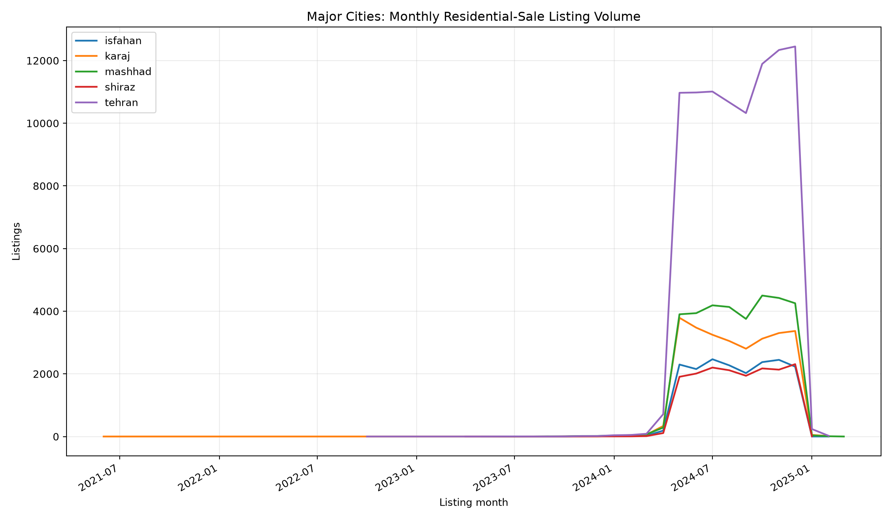

# Tehran & Major Cities Deep Dive

This extension moves the project from nationwide descriptive statistics into **local market segmentation, neighborhood analytics, approximate spatial visualization, and time-series market tracking**.

## Scope

- Tehran core listings: **91,836**
- Major cities selected by nationwide listing count: **tehran, mashhad, karaj, isfahan, shiraz**
- Neighborhood ranking minimum: **250 listings**
- Monthly trend minimum: **150 listings per city-month**
- Common trend base month: **2024-05-01**

## Tehran neighborhood analysis

Neighborhood medians are supplemented with a transparent sample-size stabilization toward the Tehran-wide median. This prevents a relatively small neighborhood sample from ranking above a much larger neighborhood solely because of sampling noise. The stabilized statistic is a benchmark, not a transaction-price estimate.

| neighborhood_slug | listings | stabilized_price_per_sqm | price_vs_city_median_pct | elevator_share | parking_share |
| --- | --- | --- | --- | --- | --- |
| zafaraniyeh | 795 | 190388814 | +181.2% | 99.3% | 98.7% |
| elahiyeh | 642 | 178040866 | +170.7% | 97.0% | 99.5% |
| velenjak | 531 | 175911745 | +179.7% | 97.8% | 99.8% |
| niavaran | 878 | 167755348 | +136.1% | 97.8% | 99.0% |
| farmaniyeh | 638 | 166017018 | +147.3% | 97.3% | 98.7% |
| darrous | 706 | 161161753 | +133.1% | 98.1% | 98.8% |
| saadat-abad | 1590 | 155815074 | +102.3% | 96.1% | 97.7% |
| qeytariyeh | 950 | 149709525 | +103.2% | 95.6% | 98.2% |
| shahrak-e-gharb | 480 | 147368827 | +124.3% | 96.9% | 97.7% |
| pasdaran | 927 | 145294892 | +96.6% | 97.1% | 98.2% |

## Major-city time trends

Raw median asking prices can move because the mix of listed properties changes. The deep-dive therefore adds a **composition-adjusted index**. Within each city, a regularized model controls for neighborhood, property category/type, building size, rooms, construction year, floor structure, advertiser type, and available amenities. The monthly median residual is then converted to an index.

The adjustment model intentionally excludes listing month, allowing the monthly residual pattern to capture time variation after observable listing mix is controlled. The median in-sample R² across successful city mix models is **0.260**. This is a descriptive adjustment, not a repeat-sales or official house-price index.

| city_slug | eligible_months | latest_median_price_per_sqm | raw_index_change_pct | composition_adjusted_index_change_pct |
| --- | --- | --- | --- | --- |
| tehran | 10 | 97368421 | -4.3% | +21.4% |
| shiraz | 8 | 40000000 | +9.6% | +20.8% |
| isfahan | 9 | 35611942 | -5.7% | +36.6% |
| karaj | 9 | 33974359 | -2.9% | +6.0% |
| mashhad | 9 | 31250000 | -4.6% | +17.1% |

## Interpretation guardrails

- The source contains **asking/listing prices**, not verified completed transaction prices.
- Neighborhood coordinates are approximate listing-location fields; the map shows neighborhood median coordinates, not legal boundaries or exact addresses.
- The time index controls for observed listing mix but cannot remove all changes in unobserved quality, seller behavior, duplicate listings, or platform coverage.
- A change in the index should be read as a change in the listed market represented by the dataset, not as an official Iranian property-price index.
- Neighborhood rankings are only shown above explicit sample thresholds and should not be used as standalone investment advice.
